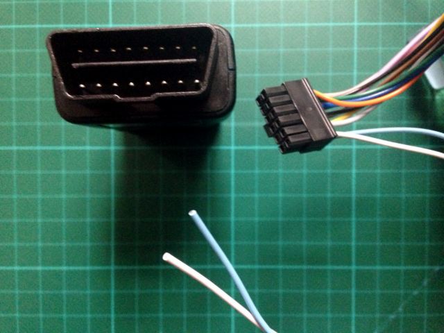
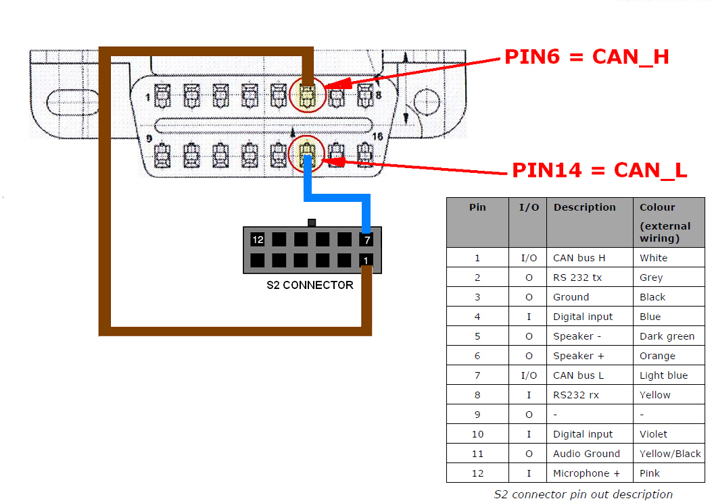

# CAN {#can}

[CAN-Bus](http://en.wikipedia.org/wiki/CAN_bus) (for *controller area network*) is a data link layer protocol used in newer vehicles which is used for monitoring and controlling most components of the car.

Greenwich Advanced devices are equipped with an CAN-Bus interface. This interface supports 11-bit or 29-bit identifiers and 250 or 500 kBit/s transfer speeds.

Other protocols may be used in (older) vehicles (e.g. PWM, VPW, ISO 9142, KWP), but these are not supported by Greenwich devices natively.


### OBD
*On-board diganostics* [OBD](http://en.wikipedia.org/wiki/On-board_diagnostics#OBD-II) is a communication protocol for automotive diagnostics.

Owntracks Greenwich implements the the current *OBD-II* (or *OBD2*) version.

### FMS

*Fleet Management System* [FMS](http://en.wikipedia.org/wiki/Fleet_Management_System) is a standard interface for commercial vehicles like trucks and buses.

Owntracks Greenwich supports FMS.

### Cabling


To connect the Greenwich to you vehicle you need an OBD-II male plug and connect the CAN-bus pins to the respective S2 molex pins according to the wiring chart below:



A variety of OBD-II plugs is available in electronics stores. A plug with an attached cable terminated in an DE-9 female connector is quite handy. Just solder the light blue and white wires of Greenwich's S2 connector to a DE-9 male connector and you are ready to go.


### Owntracks Greenwich functionality

The Greenwich monitors the vehicle FMS and OBD-II interfaces periodically. The data is published to the MQTT broker in raw format. Interpretation, processing, alarm management is performed in the backend. 

Data transmission is optimized. All values are cached in the Greenwich device and published only if changes occur.

In OBD-II, Greenwich reads all available information (may differ per vehicle type):
* of up to 8 Engine Control Units (*ECU*)
* Modes 1, 2, 3, and 9 according to the specification [OBD-II-PIDs](http://en.wikipedia.org/wiki/OBD-II_PIDs)
	this includes Mode 3 *DTC*s (Diagnostic Trouble Codes)

For FMS, Greenwich provides the full set of information:
```
Max speed
Samples with speed in 0 Kmh range
Samples with speed in 1-15 Kmh range
Samples with speed in 16-45 Kmh range
Samples with speed in 46-70 Kmh range
Samples with speed in > 70 Kmh range
Number of brakes
Samples with Cruise Control activated
Samples with PTO activated
Samples with rpm < 800
Samples with rpm in 801-1100 range
Samples with rpm in 1101-1450 range
Samples with rpm in 1451-1700 range
Samples with rpm > 1701
Total fuel used in l
Fuel level in %
Axes weight
Total engine hours
Total vehicles distances in m
Cooling liquid temperature in °C
Engine percent load at current speed
Service distance
Tachograph data (byte1, byte2, byte3, byte4 of Tachograph)
Tachograph speed
Fuel Rate
Instantaneous Fuel Economy
FMS software interface
Samples with accelerator pedal position in % < 20%
Samples with accelerator pedal position in % 20%-39% range
Samples with accelerator pedal position in % 40%-59% range
Samples with accelerator pedal position in % 60%-79% range
Samples with accelerator pedal position in % >= 80%
Selected Gear
Current Gear
```

### Settings

The FMS/OBD functionality in Owntracks Greenwich is controlled by 3 settings:

* fms=`0/1` Swithes the FMS interface off or on
* obd2Interval=`seconds` The complete set of available OBD-II data is read every `seconds`. If set to zero, OBD-II data is not read.
* obd2Sensors=`seconds` Mode 1 of available OBD-II data is read every `seconds`. If set to zero, Mode 1 data is not read.
* obd2Speed=`kBit/s` transmission speed for OBD-II protocol, default is 500
* obd2Addresses=`comma-separated-addresses` defaults to `000007e8,000007e9,000007ea,000007eb,000007ec,000007ed,000007ee,000007ef0`
* obd2Mode=`STD/EXT` switches between 11 or 29 bit identifier addresses in the OBD-II protocol

### Sample data

```
wntracks/gw/K2/obd2/000007e8/01/00 983ba013
owntracks/gw/K2/obd2/000007e8/01/01 000eeb00
owntracks/gw/K2/obd2/000007e8/01/04 8c
owntracks/gw/K2/obd2/000007e8/01/05 82
owntracks/gw/K2/obd2/000007e8/01/0b 66
owntracks/gw/K2/obd2/000007e8/01/0c 0ee0
owntracks/gw/K2/obd2/000007e8/01/0d 03
owntracks/gw/K2/obd2/000007e8/01/0f 35
owntracks/gw/K2/obd2/000007e8/01/10 03aa
owntracks/gw/K2/obd2/000007e8/01/11 6b
owntracks/gw/K2/obd2/000007e8/01/13 01
owntracks/gw/K2/obd2/000007e8/01/1c 06
owntracks/gw/K2/obd2/000007e8/01/1f 0517
owntracks/gw/K2/obd2/000007e8/01/20 a001b001
owntracks/gw/K2/obd2/000007e8/01/21 0000
owntracks/gw/K2/obd2/000007e8/01/23 0c24
owntracks/gw/K2/obd2/000007e8/01/30 23
owntracks/gw/K2/obd2/000007e8/01/31 0a47
owntracks/gw/K2/obd2/000007e8/01/33 63
owntracks/gw/K2/obd2/000007e8/01/34 0dc380f0
owntracks/gw/K2/obd2/000007e8/01/40 ccd20001
owntracks/gw/K2/obd2/000007e8/01/41 000eeb01
owntracks/gw/K2/obd2/000007e8/01/42 3930
owntracks/gw/K2/obd2/000007e8/01/45 ff
owntracks/gw/K2/obd2/000007e8/01/46 32
owntracks/gw/K2/obd2/000007e8/01/49 3a
owntracks/gw/K2/obd2/000007e8/01/4a 42
owntracks/gw/K2/obd2/000007e8/01/4c ff
owntracks/gw/K2/obd2/000007e8/01/4f 20000000
owntracks/gw/K2/obd2/000007e8/01/60 02800301
owntracks/gw/K2/obd2/000007e8/01/67 018200
owntracks/gw/K2/obd2/000007e8/01/77 0367470000
owntracks/gw/K2/obd2/000007e8/01/80 29200000
owntracks/gw/K2/obd2/000007e8/03 00
```

### Backend Processing

odb2.py

odb2 table

