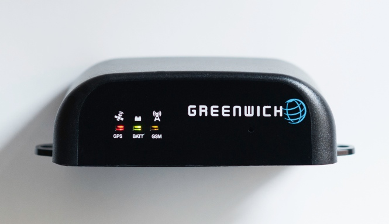

[Choral] Greenwich is a Java-programmable asset-tracking unit which
integrates GSM/GPRS and a state-of-the-art GPS receiver with a rechargeable
Li-Ion battery which gives the device autonomy for standalone applications or
anti-theft purposes. The *OwnTracks Edition* of the software,
created by [owntracks.org][owntracks], uses standardized open protocols
(MQTT) to transmit data over a secured (TLS/SSL) connection with authentication
to a server of your chosing. The data you collect is stored in your
infrastructure^[Unless you explicitly want to use our hosted platform],
and the device integrates with the iOS and Android apps developed by OwnTracks.

* Vehicle location is securely reported in a timely manner (configurable) to your server
* Data is stored in your infrastructure 
* You use our LiveTable and LiveMap to view status information of your vehicles
  in near real-time

## What can I do with a Greenwich?

You have a small or large fleet of vehicles, say, buses, transport vans,
trucks, or even just a single vehicle you want to keep track of, and you've
asked yourself one or more of these questions.

* Where are my vehicles currently? View them on a Web page from within your organization
  or on one of the OwnTracks' mobile apps.
* A customer has called to ask when the service technician will arrive; where is he?
  Your credibility rises if you can give your customer an honest and reliable answer.
* How far away is vehicle number 17 (in other words, when can I expect it back?)
* Has a particular vehicle arrived at the customer site? (Geo-fences)
* What is the weather like at the vehicle's location?
* Even if you're simply an avid traveler and wish to have an exact record of your trips,
  Greenwich _OwnTracks Edition_ is just what you need.
* CAN BUS integration is possible

The data collected on a per-vehicle basis may include location (latitude, longitude), altitude,
velocity, course over ground, battery levels (both internal Greenwich battery and external
power supply), and distance traveled. In addition the state of two user-programmable GPIO pins
is reported; these can be used, for example, to determine the state of a door (open/closed).

[owntracks]: http://owntracks.org
[choral]: http://choral.it
